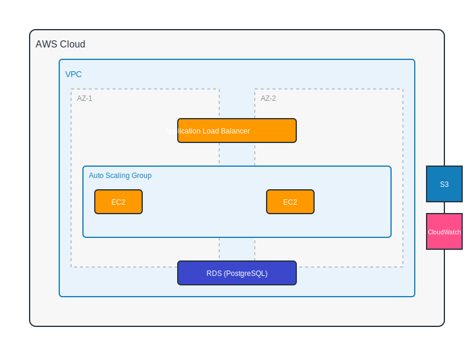

# AWS Infrastructure & Kubernetes Deployment Project



This repository contains infrastructure as code (IaC) and deployment configurations for a Django application, implementing both AWS-native architecture and Kubernetes deployment solutions.

## Project Overview

The project consists of two main components:
1. AWS Infrastructure deployment using Terraform/Cloudformmation with CI/CD
2. Kubernetes deployment on EKS using Helm

### Architecture Components

#### AWS Infrastructure (Task 1)

- **Auto Scaling Group** across multiple AZs
- **Application Load Balancer** for traffic distribution
- **EC2 instances** with Docker and Nginx reverse proxy
- **RDS (PostgreSQL)** for database
- **S3** for static files and logs
- **CloudWatch** for monitoring
- **CI/CD Pipeline** for automated deployment


    
#### Kubernetes Deployment (Task 2)
- **EKS Cluster** deployed on custom VPC
- **Helm Charts** for application deployment
- **ECR** for container registry
- **CI/CD Pipeline** for automated deployment

## Prerequisites

- AWS CLI configured with appropriate credentials
- Terraform installed (version X.X or higher)
- kubectl installed
- Helm installed
- Docker installed


### Task 1: AWS Infrastructure Deployment

1. ### Task 1 Deliverables
- Terraform scripts - cd /infrastructure 

**Initialize Terraform:**
   ```bash
   cd terraform
   terraform init
   ```

2. **Review and Apply Infrastructure:**
   ```bash
   terraform plan
   terraform apply
   ```

3. **CI/CD Pipeline:**
   - Pipeline automatically triggers on pushes to staging branch (can be modified) and deploys all parts of the architecture including the Postgre RDS located at

   ```bash
   /.github/workflows/github-workflow.yml
   ```

   - Destroy workflow available for cleanup
   
   ## Extras
   The ASGs are bootsrapped on launch to install docker and nginx, and also configures the nginx to reverse proxy all traffic from the container to port 80.
   The second part of the pipeline deploys the EC2s and runs the containers as well.

### Task 2: Kubernetes Deployment Commands

1. **Deploy VPC using CloudFormation:**
   ```bash
   aws cloudformation deploy --template-file vpc.yaml --stack-name eks-vpc
   ```

2. **Build and Push Docker Image:**
   ```bash
   docker build -t app-name .
   docker push <ECR-REPOSITORY-URL>/app-name:latest
   ```
I set up the docker image on ECR for the EKS.


3. **Deploy to EKS using Helm:**
   ```bash
   helm upgrade --install app-name ./helm-charts/app-name
   ```
## Extras
I added a CICD pipeline to automate the deployment of this EKS deployment to the VPC created by the Cloudformation template.

## Project File Structure

- Architecture diagram 
- Terraform script - /infrastructure/*
- Cloudformation VPC for EKS - /cloudformation/
- kubernetes manifest files - /kubernetes/app-deployment
- Helm Chart - /kubernetes/helm-app
- Dockerfile - ./Dockerfile
- Terraform pipeline + EC2 bootstrap pipeline - /.githhub/workflows/github-workflow.yml
- EKS CICD pipeline - /.github/workflows/deploy-eks.yaml


## Security Considerations

Current Implementation:
- IAM roles and security groups implemented
- NGINX reverse proxy configured
- EC2 instances in private subnets
- RDS in private subnets

## Missing Deliverables

- CloudFormation equivalent of Terraform configuration
- Monitoring using Cloudwatch

 ## Future Improvements:
   - Implement AWS Secrets Manager
   - Add comprehensive monitoring dashboards
   - Enhance backup and disaster recovery procedures

## Contributing

1. Fork the repository
2. Create a feature branch
3. Submit a pull request
